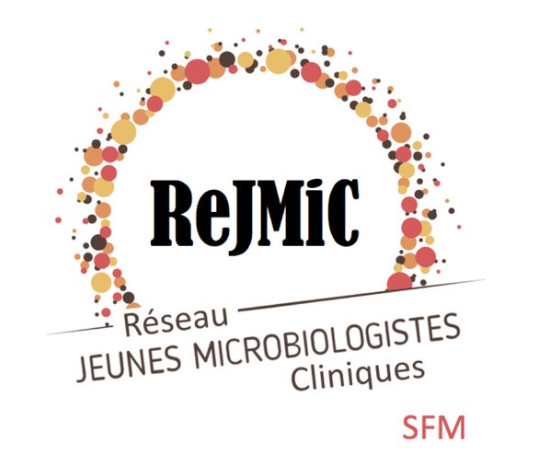

# Journée bioinformatique n°2
---

**Le [ReJMIC](https://www.sfm-microbiologie.org/presentation-de-la-sfm/sections-et-groupes-de-travail/rejmic/) présente une journée d'inititation à la bioinformatique avec pour thématique : "Initatition aux statistiques en biologie"**

## Informations pratiques:
- Le 24/06/2022 (9h-17h)
- Salle 119 (campus Jussieu)

:round_pushpin: **Campus de Jussieu** Université Pierre et Marie Curie (UPMC) - **4, place Jussieu 75005 PARIS**

**Accès**
- en voiture (Parking souterrain gratuit : Entrée par la rue des Fossés Saint-Bernard, à hauteur de la tour 12)
- en métro : Ligne 7 ou 10 **station Jussieu**
- en bus : Ligne 67, 89 arrêt Jussieu ou lignes 24, 63 arrêt "Université Paris 6"

  

## Intervenants :
**Noshine Mohammad** (Doctorante en Machine et Deep Learning au Laboratoire de Parasitologie à l'Hôpital Universitaire de la Pitié-Salpêtrière - Sorbonne Université)

**Maël Pretet** (Data-scientist, Direction Appui, Traitements et Analyses des données DATA, Santé publique France) 

**Dr Alexandre Godmer** (AHU département de bactériologie, site hôpital Saint-Antoine, Doctorant en thèse d'université, Sorbonne-Université, INSERM, U1135, Centre d’Immunologie et des Maladies Infectieuses, [Cimi-Paris](https://cimiparis.fr/), Paris). 

## Programme :

- **Disponible à ce [lien](Cours/Rejmic_intro_2022.pdf)**

|  Cours | Horaires  | Intervenants  | Liens  |
|---     |---        |---            |---     |
| Introduction aux statistiques de base|9-10h|Mael Pretet|[cours 1](Cours/Introduction_aux_statistiques.pdf)|
| Decouverte de l'analyse en composantes principales|10h15-11h15|Alexandre Godmer|[cours 2](Cours/AlexGodmer_cours_PCA.pdf)|   
| Introduction à R|11h30-12h25|Nohine mohammad|[cours 3](https://agodmer.github.io/StatistiquesR_ReJMICJournee2/Cours/TP_intro_R_versionApprenants.html)|
| Déjeuner |12h45-14h|:taco:|
|Travaux pratiques|14h-16h45|Noshine Mohammad, Alexandre Godmer, Mael Pretet|[cours 4](Cours/MALDI_intro_TP.pdf)|

- **Documents pour les cours et TP :**
  - **Cours 3 :** introduction à R; le [notebook version apprenant](Cours/TP_intro_R_versionApprenants.Rmd) ; les [données](Data/Snore.txt)
  - **Travaux Pratiques :** le [notebook](https://agodmer.github.io/StatistiquesR_ReJMICJournee2/Cours/TP_ReJMIC2022.html) ; les [données](https://github.com/agodmer/MSData/tree/main/ShigaToxigenicEscherichia)

- **Quelques liens utiles pour les cours :**
  - [Markdown](https://blog.sqlbak.com/jupyter-notebook-markdown-cheatsheet)
  - [Rstudio](https://ourednik.info/maps/2019/03/14/premiers-pas-avec-r-et-rstudio/)
---
- **Participation :**

  

---
**Organisé par le ReJMIC :**

  

**Avec le soutien de Sorbonne Université :**

  

**Nous remercions le service [Capsule Sorbonne Université](https://sciences.sorbonne-universite.fr/faculte/ufr-instituts-observatoires-ecoles/capsule)  pour les locaux et la [Société Française de Microbiologie](https://www.sfm-microbiologie.org/) pour son soutien :**

  

  

